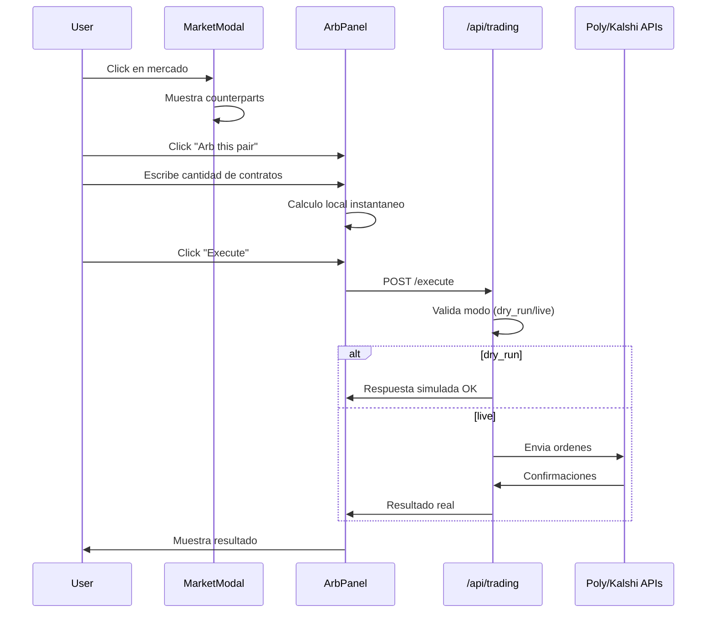

# Plan: Arb Trading UI + Bot de Monitoreo

## Fase 1 -- UI de compra de arbitraje (prioridad)

### 1.1 Backend: capa de trading

Crear `backend/trading.py` con la logica de ejecucion de ordenes. Como todavia no hay API keys, las funciones de ejecucion arrancan en modo **dry-run** (simulan la orden, loguean, devuelven respuesta fake). Cuando las keys esten disponibles se conectan sin cambiar la interfaz.

```python
# backend/trading.py (estructura)
async def execute_order(exchange, market_id, side, contracts, price) -> OrderResult
async def execute_arb(side_a, side_b) -> ArbResult
def calculate_arb_preview(market_a, market_b, contracts) -> ArbPreview
```

Crear `backend/trading_config.py` que lea credenciales del `.env`:

```
POLYMARKET_API_KEY=
POLYMARKET_SECRET=
KALSHI_API_KEY=
KALSHI_SECRET=
TRADING_MODE=dry_run   # dry_run | live
```

Nuevo endpoint en [backend/main.py](backend/main.py):

- `POST /api/trading/preview` -- recibe `market_a_id`, `market_b_id`, `contracts` y devuelve costos, payout, edge
- `POST /api/trading/execute` -- ejecuta el arb (dry-run o live segun config)

### 1.2 Frontend: panel de Arb en el modal

Modificar [frontend/src/components/MarketModal.tsx](frontend/src/components/MarketModal.tsx). En la seccion de counterparts, agregar boton "Arb this pair" que expande un panel inline:

```
Counterpart: "Bitcoin > 100k" (Kalshi)
[Arb this pair v]

  Contracts: [___100___]

  Side A (Poly YES):  100 x 33c = $33.00
  Side B (Kalshi NO): 100 x 60c = $60.00

  Total cost:     $93.00
  Payout:         $100.00
  Profit:         $7.00 (+7.5%)

  [Execute Arb]   [Cancel]
```

Componente nuevo: `frontend/src/components/ArbPanel.tsx`

- Input de contratos (numero)
- Calculo local instantaneo: `cost_a = contracts * ask_a`, `cost_b = contracts * ask_b`
- Boton "Execute" llama a `POST /api/trading/execute`
- Estado: idle / previewing / executing / success / error

Nuevo hook: `frontend/src/hooks/useArbExecution.ts`

- `preview(marketA, marketB, contracts)` -- llama al backend
- `execute(marketA, marketB, contracts)` -- llama al backend
- Maneja loading, error, result

### 1.3 Flujo de datos




---

## Fase 2 -- Bot de monitoreo local (posterior)

### 2.1 Estructura del bot

Crear directorio `bot/` en la raiz del proyecto:

```
bot/
  bot.py            -- proceso principal con scheduler
  config.py         -- lee .env, intervalo, modo
  positions.py      -- fetch posiciones abiertas de ambos exchanges
  rules_engine.py   -- evalua reglas contra posiciones
  executor.py       -- cierra posiciones si regla se cumple
  notifier.py       -- envia alertas (Telegram/Discord)
  db.py             -- SQLite para snapshots horarios
  rules.json        -- reglas editables por el usuario
```

### 2.2 Motor de reglas

Reglas definidas en JSON:

```json
[
  { "type": "take_profit", "threshold_pct": 10 },
  { "type": "stop_loss", "threshold_pct": -15 },
  { "type": "days_to_close", "min_days": 3 },
  { "type": "spread_inverted" }
]
```

### 2.3 Scheduler

`APScheduler` con job cada hora:

1. Fetch posiciones abiertas de Poly + Kalshi
2. Guardar snapshot en SQLite
3. Evaluar cada posicion contra las reglas
4. Si alguna regla se dispara: ejecutar cierre + notificar

### 2.4 Despliegue en PC secundaria

- Script `bot/install_service.bat` que usa NSSM para registrar como servicio de Windows
- Alternativa: `.bat` con loop y auto-restart
- El bot lee la misma config `.env` del proyecto

### 2.5 Notificaciones

`bot/notifier.py` soporta:

- Telegram bot (via HTTP API, solo necesita token + chat_id)
- Discord webhook (un POST)
- Configurable en `.env`

---

## Archivos a crear/modificar

**Fase 1 (arb UI):**

- Crear: `backend/trading.py`, `backend/trading_config.py`
- Modificar: [backend/main.py](backend/main.py) (2 endpoints nuevos)
- Crear: `frontend/src/components/ArbPanel.tsx`
- Crear: `frontend/src/hooks/useArbExecution.ts`
- Modificar: [frontend/src/components/MarketModal.tsx](frontend/src/components/MarketModal.tsx) (integrar ArbPanel)
- Modificar: `.env` (agregar variables de trading)

**Fase 2 (bot):**

- Crear: directorio `bot/` completo (7 archivos)
- Crear: `bot/requirements.txt` (apscheduler, httpx, aiosqlite)
- Crear: `bot/install_service.bat`

